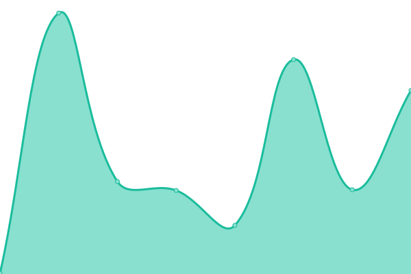

# [📈 Live Status](https://status.ipe.wjghj.cn): <!--live status--> **好耶，系统全功率运转中~**

This repository contains the open-source uptime monitor and status page for [InPageEdit Technology](https://ipe.js.org), powered by [Upptime](https://github.com/upptime/upptime).

With [Upptime](https://upptime.js.org), you can get your own unlimited and free uptime monitor and status page, powered entirely by a GitHub repository. We use [Issues](https://github.com/InPageEdit/status/issues) as incident reports, [Actions](https://github.com/InPageEdit/status/actions) as uptime monitors, and [Pages](https://status.ipe.wjghj.cn) for the status page.

<!--start: status pages-->
<!-- This summary is generated by Upptime (https://github.com/upptime/upptime) -->
<!-- Do not edit this manually, your changes will be overwritten -->
<!-- prettier-ignore -->
| URL | 状态 | 历史 | 响应时间 | 可用率 |
| --- | ------ | ------- | ------------- | ------ |
|  [Official Website](https://www.ipe.wiki) | 正常运行 | [official-website.yml](https://github.com/inpageedit/status/commits/HEAD/history/official-website.yml) | 

 440ms
     
 | 

<a href="https://status.ipe.wiki/history/official-website">98.12%</a>
    

|  [Plugin Registry v1](https://registry.ipe.wiki/registry.v1.json) | 正常运行 | [plugin-registry-v1.yml](https://github.com/inpageedit/status/commits/HEAD/history/plugin-registry-v1.yml) | 

 244ms
     
 | 

<a href="https://status.ipe.wiki/history/plugin-registry-v1">98.22%</a>
    

|  [Analytics Dashboard](https://analytics.ipe.wiki/) | 正常运行 | [analytics-dashboard.yml](https://github.com/inpageedit/status/commits/HEAD/history/analytics-dashboard.yml) | 

 3435ms
     
 | 

<a href="https://status.ipe.wiki/history/analytics-dashboard">98.47%</a>
    

|  [Analytics API v6](https://analytics.ipe.wiki/api/v6/usage/recent?limit=1) | 正常运行 | [analytics-api-v6.yml](https://github.com/inpageedit/status/commits/HEAD/history/analytics-api-v6.yml) | 

 211ms
     
 | 

<a href="https://status.ipe.wiki/history/analytics-api-v6">98.63%</a>
    

<!--end: status pages-->

[**Visit our status website →**](https://status.ipe.wjghj.cn)

## 📄 License

- Powered by: [Upptime](https://github.com/upptime/upptime)
- Code: [MIT](./LICENSE) © [InPageEdit Technology](https://ipe.js.org)
- Data in the `./history` directory: [Open Database License](https://opendatacommons.org/licenses/odbl/1-0/)
