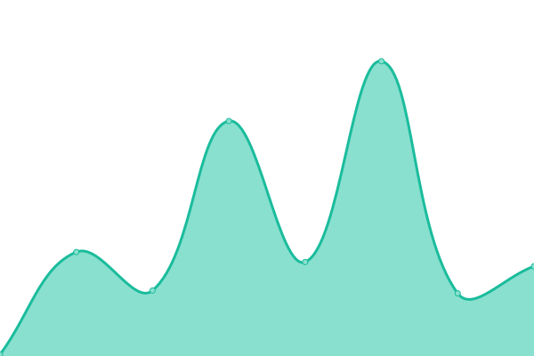

# [📈 Live Status](https://status.ipe.wjghj.cn): <!--live status--> **好耶，系统全功率运转中~**

This repository contains the open-source uptime monitor and status page for [InPageEdit Technology](https://ipe.js.org), powered by [Upptime](https://github.com/upptime/upptime).

With [Upptime](https://upptime.js.org), you can get your own unlimited and free uptime monitor and status page, powered entirely by a GitHub repository. We use [Issues](https://github.com/InPageEdit/status/issues) as incident reports, [Actions](https://github.com/InPageEdit/status/actions) as uptime monitors, and [Pages](https://status.ipe.wjghj.cn) for the status page.

<!--start: status pages-->
<!-- This summary is generated by Upptime (https://github.com/upptime/upptime) -->
<!-- Do not edit this manually, your changes will be overwritten -->
<!-- prettier-ignore -->
| URL | 状态 | 历史 | 响应时间 | 可用率 |
| --- | ------ | ------- | ------------- | ------ |
|  [jsDelivr CDN](https://cdn.jsdelivr.net/npm/mediawiki-inpageedit@latest/dist/InPageEdit.js) | 正常运行 | [js-delivr-cdn.yml](https://github.com/InPageEdit/status/commits/HEAD/history/js-delivr-cdn.yml) | 

 67ms
     
 | 

<a href="https://status.ipe.wjghj.cn/history/js-delivr-cdn">100.00%</a>
    

|  [Plugins Store](https://ipe-plugins.js.org) | 正常运行 | [plugins-store.yml](https://github.com/InPageEdit/status/commits/HEAD/history/plugins-store.yml) | 

 111ms
     
 | 

<a href="https://status.ipe.wjghj.cn/history/plugins-store">100.00%</a>
    

|  [Documentation](https://ipe.js.org) | 正常运行 | [documentation.yml](https://github.com/InPageEdit/status/commits/HEAD/history/documentation.yml) | 

 98ms
     
 | 

<a href="https://status.ipe.wjghj.cn/history/documentation">100.00%</a>
    

|  [Analysis Backend v4](https://analysis.ipe.wjghj.cn/api/query/wiki) | 正常运行 | [analysis-backend-v4.yml](https://github.com/InPageEdit/status/commits/HEAD/history/analysis-backend-v4.yml) | 

 626ms
     
 | 

<a href="https://status.ipe.wjghj.cn/history/analysis-backend-v4">100.00%</a>
    

|  [Analysis Frontend](https://blog.wjghj.cn/inpageedit/) | 正常运行 | [analysis-frontend.yml](https://github.com/InPageEdit/status/commits/HEAD/history/analysis-frontend.yml) | 

 287ms
     
 | 

<a href="https://status.ipe.wjghj.cn/history/analysis-frontend">100.00%</a>
    

<!--end: status pages-->

[**Visit our status website →**](https://status.ipe.wjghj.cn)

## 📄 License

- Powered by: [Upptime](https://github.com/upptime/upptime)
- Code: [MIT](./LICENSE) © [InPageEdit Technology](https://ipe.js.org)
- Data in the `./history` directory: [Open Database License](https://opendatacommons.org/licenses/odbl/1-0/)
